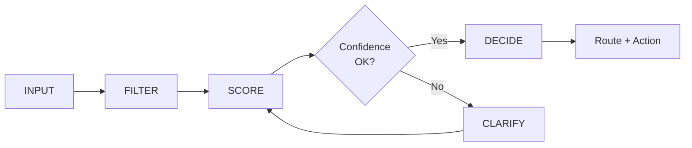
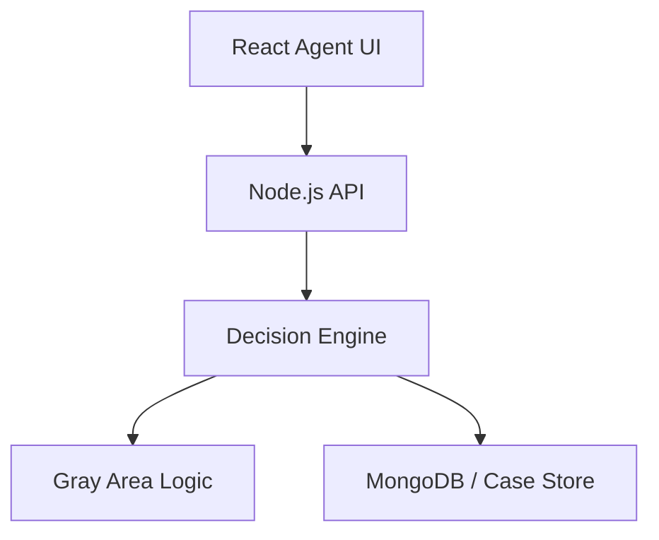

<p align="center">
  
</p>

# Call Helper (CH)

**Operational Decision Support System**

> Independent project · Contact center operations · Product & systems design case study

[](https://hudaalzharani-commits.github.io/huda-portfolio/#demo)
[](./docs/README.md)

---

## Overview

**Call Helper (CH)** is an AI-assisted operational decision support system built for contact center environments.

It helps agents move from unstructured guessing to **validated, route-aware decisions** during live calls — parsing intent, scoring confidence, and recommending resolution pathways when signals are clear enough to act.

This repository is a **public project showcase**. It documents product thinking, system architecture, and decision design — not proprietary source code.

---

## Problem

Contact center agents often face the same underlying gap:

- Information exists across multiple systems, but **decision paths are unclear**
- Agents work under time pressure with **no structured guidance**
- Ambiguous calls lead to **wrong routing, repeated transfers, and unnecessary escalation**

The issue is rarely access to data alone — it is **how decisions are made under pressure**.

**Example scenario:**

> *"Caller can't access their permit. Not sure why."*

Without structure, agents may guess issue type, check systems manually, and escalate without a clear diagnosis.

---

## Solution

CH introduces a **decision layer** between raw caller input and agent action:

1. Parse natural-language issue descriptions
2. Extract operational signals and match against case patterns
3. Score confidence before recommending a route
4. Clarify ambiguity through structured Gray Area logic
5. Output a guided resolution path for the agent

> *"CH doesn't replace agents — it helps them think clearly under pressure."*

---

## Key Features

| Feature | Description |
|---------|-------------|
| **Intent parsing** | Extracts keywords and issue signals from call descriptions |
| **Confidence scoring** | Evaluates match strength before routing |
| **Decision routing** | Recommends operational pathways by issue type |
| **Gray Area logic** | Handles vague, ambiguous, and conflicting inputs via clarification |
| **Case tracking** | Supports pattern recognition across recurring issues |
| **Modular workflows** | Domain pathways: registration, activation, qualification, service status |

See [Feature Overview](./docs/feature-overview.md) for details.

---

## Decision Flow



**Pipeline:** `Input → Filter → Score → Decide`

Full documentation: [Decision Pipeline](./architecture/decision-pipeline.md)

---

## System Architecture



| Layer | Technologies |
|-------|--------------|
| Frontend | React, JavaScript, CSS |
| Backend | Node.js, Express |
| Engine | Custom routing logic, scoring engine, Gray Area module |
| Data | MongoDB, case-based design, keyword matching, metadata filtering |
| Design | Figma, Miro, UI flow design, logic mapping |

Full documentation: [System Architecture Overview](./architecture/system-architecture-overview.md)

---

## Screenshots

English UI captures from the **Call Helper** application — onboarding flow, agent workspace, and admin operations.

### Start Page

Landing screen where agents enter the system.


### Login

Secure sign-in for agents and administrators.


### Logo

Call Helper brand mark used across the application.

<p align="center">
  
</p>

Vector asset: [`assets/ch-logo.svg`](./assets/ch-logo.svg)

### Live Indicators (Dashboard)

Operational dashboard — live indicators with **This month** filter and services rail.


### Call Assistant

Smart Call Helper — agent workspace for case analysis and guided responses.


### Admin Dashboard

Admin panel — operational pulse, intelligence center, and system management.


---

**Interactive demo:** [Portfolio — CH Decision Engine](https://hudaalzharani-commits.github.io/huda-portfolio/#demo)

All captures live in [`screenshots/`](./screenshots/).

---

## Live Portfolio

The full case study — including an interactive CH demo — is hosted on GitHub Pages:

**[https://hudaalzharani-commits.github.io/huda-portfolio/](https://hudaalzharani-commits.github.io/huda-portfolio/)**

Portfolio repository: [huda-portfolio](https://github.com/hudaalzharani-commits/huda-portfolio)

---

## Technologies Used

### Core — Backend & Engine
`Node.js` · `Express` · Decision Routing Logic · Custom Scoring Engine · Gray Area Logic

### Core — Frontend
`React` · `JavaScript` · `CSS`

### Data & Knowledge
`MongoDB` · Case-Based Design · Keyword Matching · Metadata Filtering

### Design & Architecture
`Figma` · `Miro` · UI Flow Design · Logic Mapping

### Dev & Validation
`VS Code` · `GitHub` · Localhost development · Manual scenario testing · `Jira`

---

## Project Impact

Qualitative outcomes observed during design and validation:

| Outcome | Description |
|---------|-------------|
| **Faster decisions** | Structured pipeline reduces time spent guessing issue type |
| **Clearer responses** | Agents receive route-aware guidance instead of ad-hoc troubleshooting |
| **Less escalation** | Clarification logic reduces blind handoffs and wrong-desk routing |

**Research context:** The system design was informed by direct contact center operations experience and analysis of **100+ real call scenarios** during product development.

> *"The real problem wasn't access to information — it was how decisions are made under pressure."*

---

## Why The Source Code Is Private

This repository is intentionally a **showcase**, not a code dump.

| Reason | Explanation |
|--------|-------------|
| **Proprietary logic** | Decision routing rules, scoring weights, and Gray Area thresholds reflect operational knowledge developed through direct experience |
| **Case data patterns** | MongoDB schemas and case-m matching patterns are tied to real operational workflows |
| **Product integrity** | Public architecture docs demonstrate system thinking without exposing implementation details competitors could replicate |
| **Professional context** | Suitable for recruiter, academy, and interview review without open-sourcing a production-intent system |

Architecture, flows, and product rationale are fully documented here. Source access is available on request for authorized reviewers.

---

## Repository Structure

```text
Call-Helper-showcase/
├── README.md                          # Project showcase (this file)
├── assets/
│   ├── ch-project-banner.svg          # Repository banner
│   └── ch-logo.svg                    # Brand logo (vector)
├── architecture/
│   ├── system-architecture-overview.md
│   ├── decision-pipeline.md
│   └── gray-area-logic.md
├── docs/
│   ├── README.md
│   ├── product-context.md
│   ├── feature-overview.md
│   ├── before-vs-with-ch.md
│   └── glossary.md
└── screenshots/
    ├── en-start-page.png
    ├── en-login-page.png
    ├── en-logo.png
    ├── en-live-indicators-month.png
    ├── en-call-assistant-lines.png
    ├── en-admin-dashboard.png
    └── README.md
```

---

## Author

**Huda Mohammed AL Zahrani**  
Product Builder · TPM · Systems Thinker

- Portfolio: [hudaalzharani-commits.github.io/huda-portfolio](https://hudaalzharani-commits.github.io/huda-portfolio/)
- GitHub: [@hudaalzharani-commits](https://github.com/hudaalzharani-commits)
- CV: Available on [portfolio download section](https://hudaalzharani-commits.github.io/huda-portfolio/#contact)

---

## License & Usage

This showcase documentation is provided for portfolio and review purposes. System implementation, routing logic, and associated intellectual property remain private unless otherwise agreed in writing.
