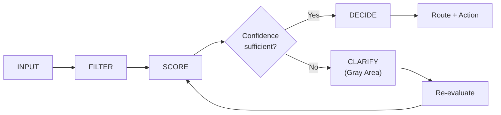

# Decision Pipeline

End-to-end decision flow from agent input to guided resolution output.

## Pipeline Stages



## Stage Descriptions

### 1. Input

Agent or demo user describes the caller's issue in natural language.

**Example:** *"Caller can't access their permit. Not sure why."*

### 2. Filter

System tokenizes and filters input to extract operational signals and metadata.

### 3. Score

Confidence is evaluated against case history and keyword/pattern matching.

### 4. Clarify (Gray Area)

If confidence is insufficient:

- System presents structured clarification options
- Agent or user selects primary issue type
- Pipeline re-runs scoring with enriched signals

### 5. Decide

When confidence threshold is met, CH outputs:

- Issue classification
- Confidence indicator
- Recommended route
- Suggested next action

## Public Demo Pipeline

The portfolio live demo visualizes this pipeline in real time:

```text
Input → Signal → Confidence → Route
```

Try it on the [Live Portfolio Demo](https://hudaalzharani-commits.github.io/huda-portfolio/#demo).

## Design Intent

> *"CH does not guess — it validates before deciding."*

The pipeline prioritizes **decision quality** over speed-of-guess, especially for ambiguous or multi-issue inputs.
