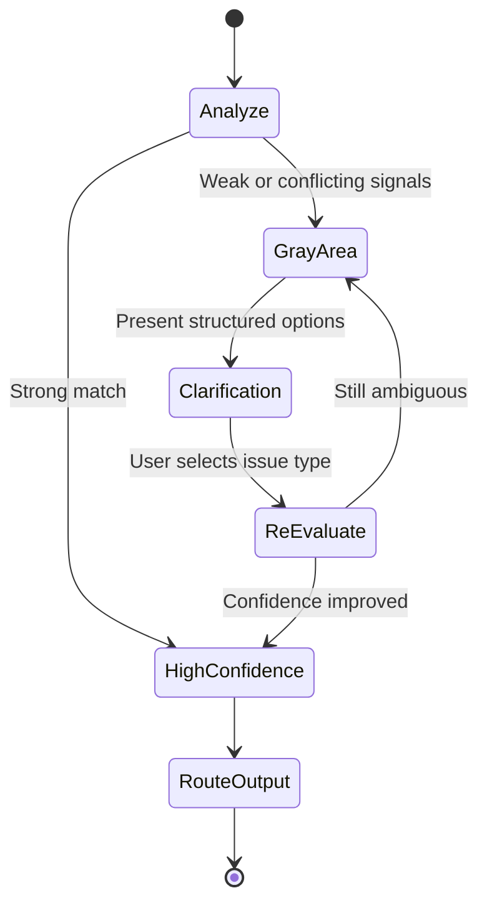

# Gray Area Logic

How Call Helper (CH) handles ambiguous, conflicting, and low-confidence inputs.

## When Gray Area Activates

| Trigger | Example |
|---------|---------|
| **Vague input** | "I have a problem", "help", "not working" |
| **Low signal density** | Too few keywords to classify confidently |
| **Conflicting signals** | "Payment failed and permit not showing" |
| **Under-specified context** | Issue type unclear (technical vs operational) |

## Behavior

## Clarification Flow

1. **Detect** low confidence or conflicting signals
2. **Surface** labeled clarification options (not open-ended guessing)
3. **Incorporate** selected signal into re-evaluation
4. **Update** confidence score transparently
5. **Route** only when validation threshold is met

## Product Rationale

Contact center calls often start vague. A system that routes immediately on weak signals creates:

- Wrong desk assignments
- Repeated transfers
- Unnecessary escalations

Gray Area Logic converts ambiguity into a **structured decision step** instead of a failure mode.

## Agent Experience

> *"CH improves confidence when signals become clearer."*

Agents see the system working *with* them — not overriding them — during unclear moments.

## Related

- [Decision Pipeline](./decision-pipeline.md)
- [Before vs With CH](../docs/before-vs-with-ch.md)
