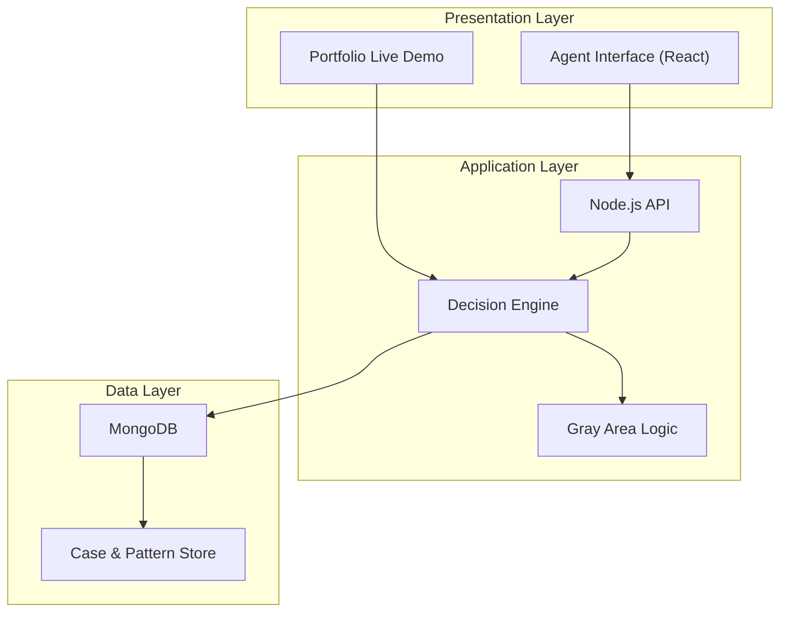

# System Architecture Overview

High-level architecture of the Call Helper (CH) decision support system. This document describes **design layers and responsibilities** — not proprietary implementation details.

## Layered Architecture

## Component Responsibilities

| Layer | Components | Role |
|-------|------------|------|
| **Presentation** | React, JavaScript, CSS | Agent input, decision output display, status feedback |
| **Application** | Node.js, Express, Decision Engine | Request handling, routing logic, confidence scoring |
| **Decision Logic** | Custom scoring, Gray Area module | Parse signals, validate confidence, clarify ambiguity |
| **Data** | MongoDB, case-based design | Persist cases, metadata, and pattern references |

## Design Characteristics

- **Modular workflows** — domain pathways can expand independently
- **Case-based knowledge** — decisions informed by operational case patterns
- **Separation of concerns** — UI, API, and engine logic are distinct layers
- **Local development stack** — frontend (`:3000`) and backend (`:5000`) during build and test

## Related Documents

- [Decision Pipeline](./decision-pipeline.md)
- [Gray Area Logic](./gray-area-logic.md)
- [Feature Overview](../docs/feature-overview.md)

## Design Tools

Architecture and flows were mapped using **Figma**, **Miro**, UI flow design, and logic mapping before implementation.
